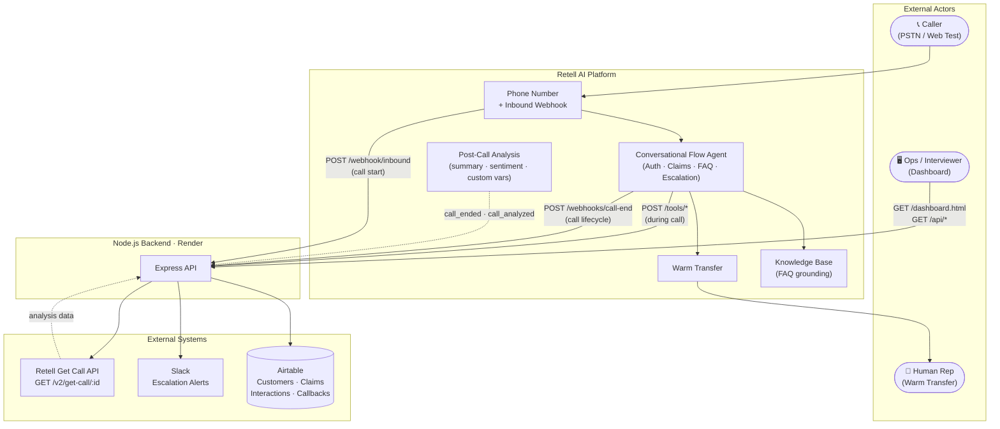
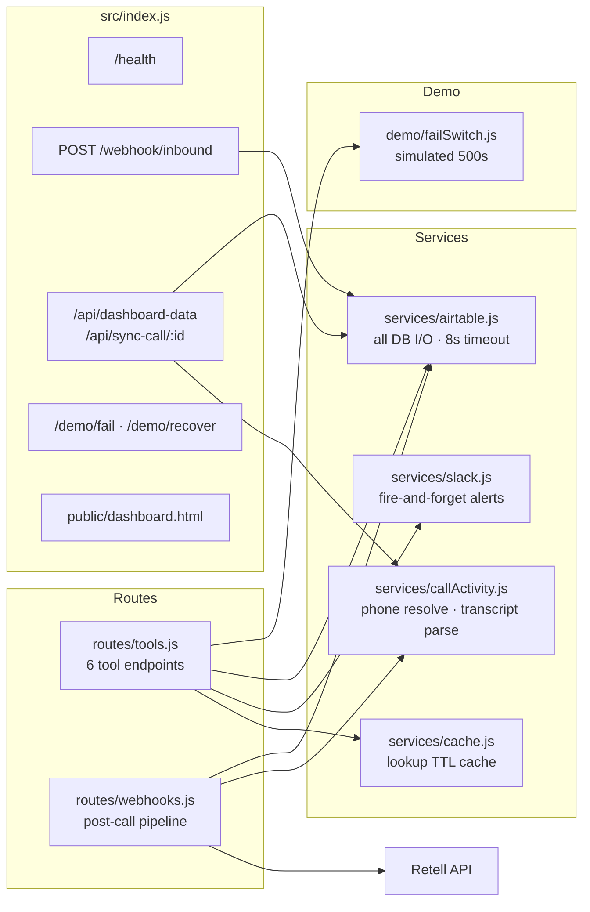
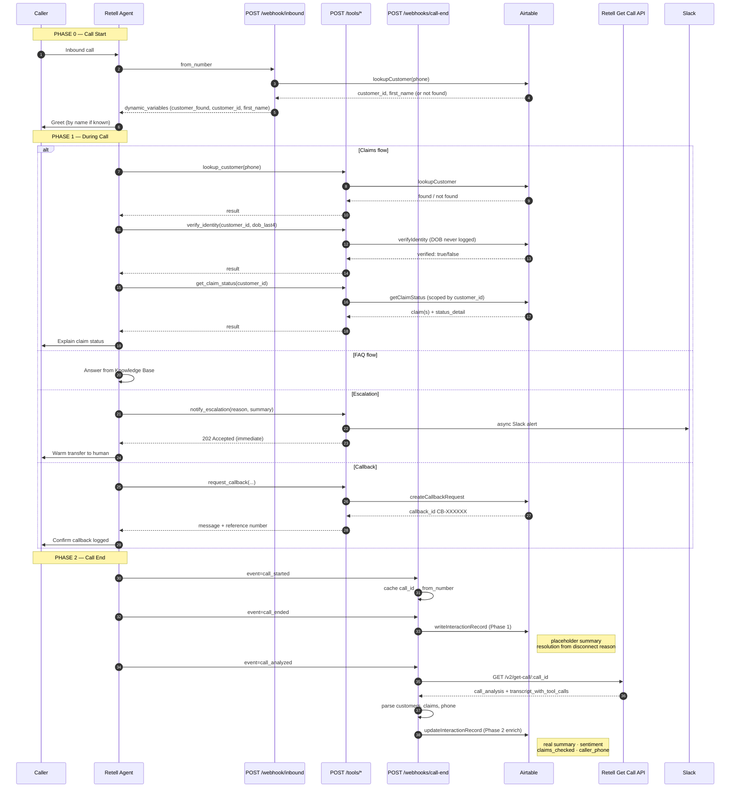
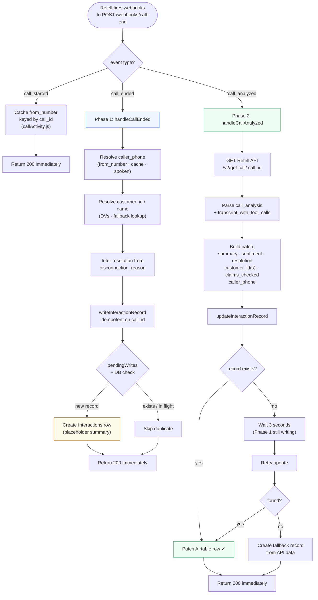
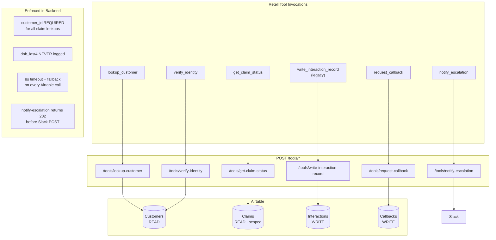
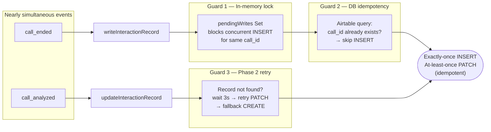
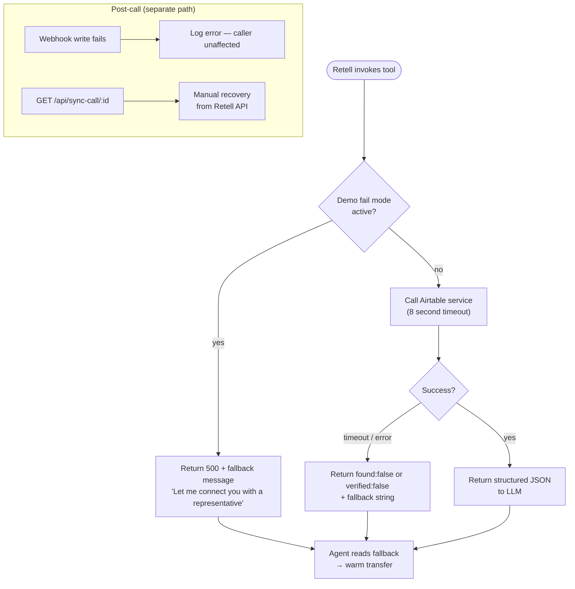
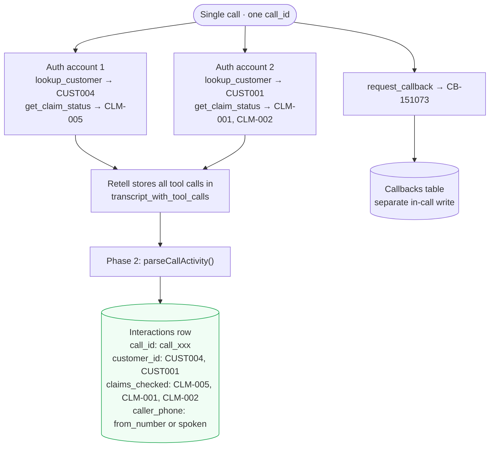

# Architecture Diagrams — Observe Insurance Claims Agent

Use these Mermaid diagrams in your interview. They render on GitHub, in VS Code/Cursor, and at [mermaid.live](https://mermaid.live).

**Tip for presenting:** Start with Diagram 1 (big picture), then zoom into Diagram 3 (call lifecycle), then Diagram 4 (post-call pipeline) when they ask about persistence.

---

## Diagram 1 — System Context (Start Here)

High-level view: who talks to whom.



---

## Diagram 2 — Backend Internal Modules

How the Express app is organized inside `src/`.



---

## Diagram 3 — Full Call Lifecycle (Sequence)

Walk through this when asked *"what happens when someone calls?"*



---

## Diagram 4 — Post-Call Two-Phase Pipeline

Deep dive for *"how do interaction records get written?"*



---

## Diagram 5 — Tool Endpoints & Data Access

Security and read/write boundaries — good for *"what does each tool do?"*



---

## Diagram 6 — Idempotency & Race Condition Guards

For *"how do you prevent duplicate records?"*



---

## Diagram 7 — Graceful Degradation

For *"what happens when Airtable is down?"*



---

## Diagram 8 — Multi-Customer Call Handling

For *"what if one call checks two accounts?"*



---

## How to Use in the Interview

| When they ask… | Show diagram |
|---|---|
| "Give me the big picture" | **Diagram 1** — System Context |
| "How is the code organized?" | **Diagram 2** — Backend Modules |
| "Walk me through a call" | **Diagram 3** — Sequence (step through numbered steps) |
| "How does post-call analysis work?" | **Diagram 4** — Two-Phase Pipeline |
| "What are your tools / integrations?" | **Diagram 5** — Tools & Data Access |
| "Duplicate records / race conditions?" | **Diagram 6** — Idempotency Guards |
| "What if the backend fails?" | **Diagram 7** — Graceful Degradation |
| "Edge cases?" | **Diagram 8** — Multi-Customer Call |

### Export for slides

1. Copy any diagram block (without the ` ```mermaid ` fences) into [mermaid.live](https://mermaid.live)
2. Export as PNG or SVG
3. Paste into Google Slides / Keynote

### Render in Cursor / VS Code

Open this file and use Markdown preview — Mermaid renders natively in most editors.

---

## Related Docs

- [`BACKEND_INTERVIEW_GUIDE.md`](./BACKEND_INTERVIEW_GUIDE.md) — Full narrative + Q&A
- [`README.md`](./README.md) — Platform specifications & API reference
